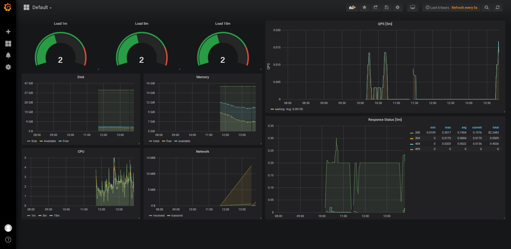

# Gatekeeper

### Features

 - Monitoring and Analytics with [Prometheus](https://prometheus.io/) and [Grafana](https://grafana.com/)
 - Database storage with [PostgreSQL](https://www.postgresql.org/) and [TimescaleDB](https://www.timescale.com/)
 - Docker integration
 - Security Authentication and Authorization
 - Quota and Rate limiting
 - Cache with Redis
 - Circuit Break
